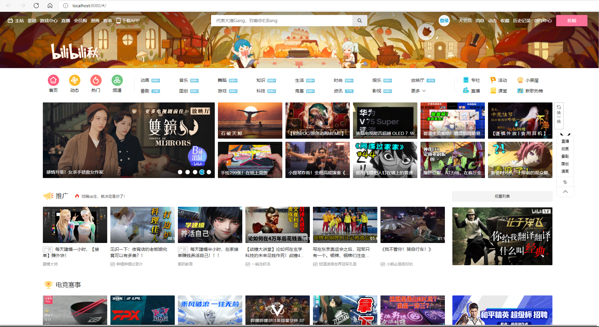
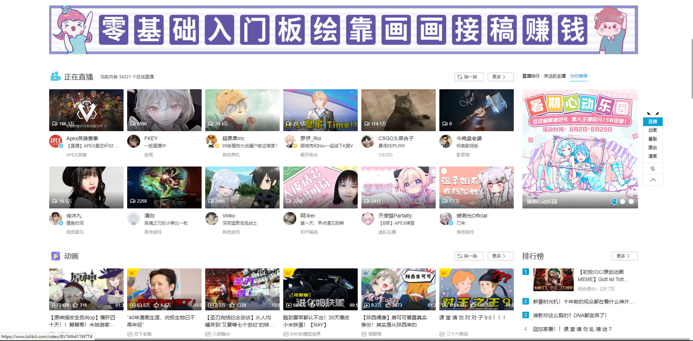
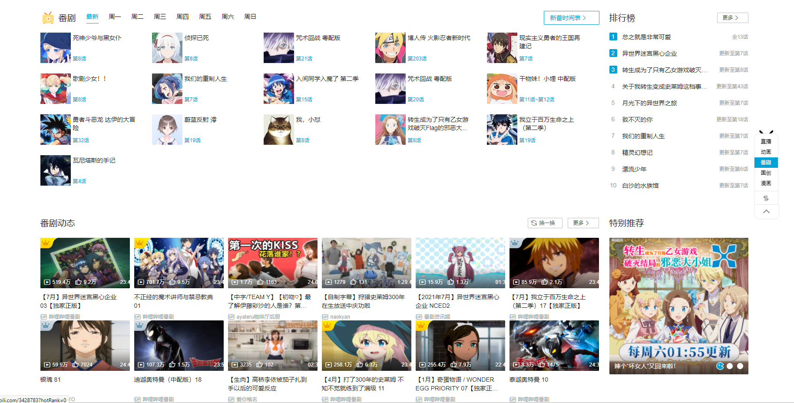
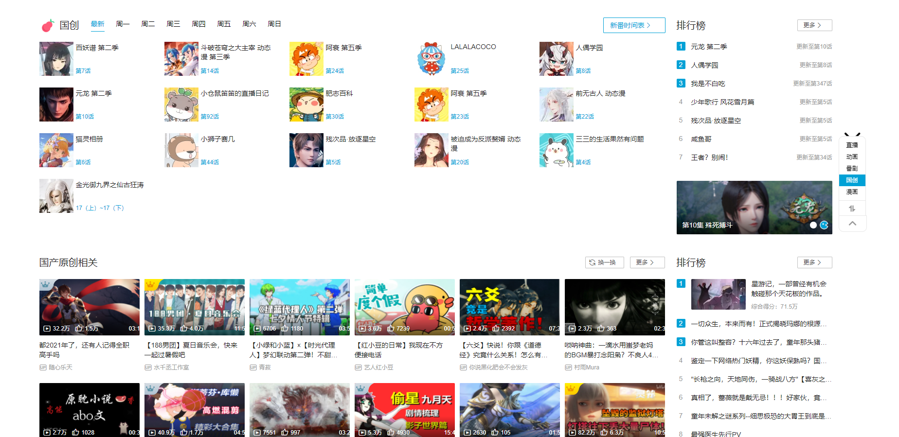
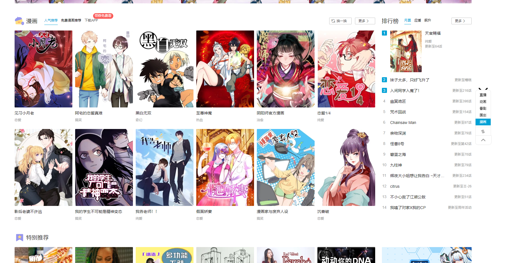
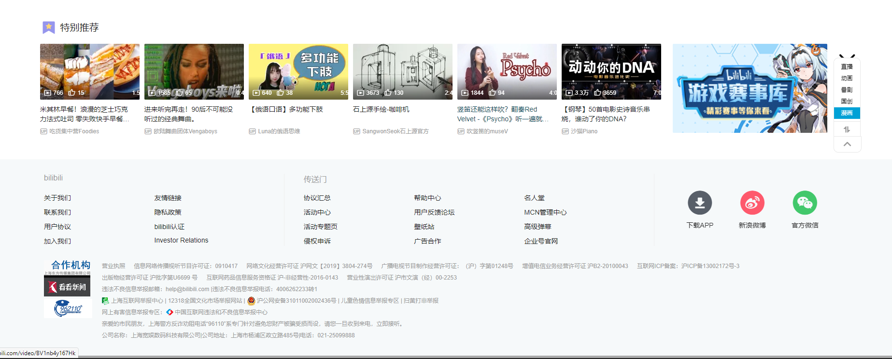
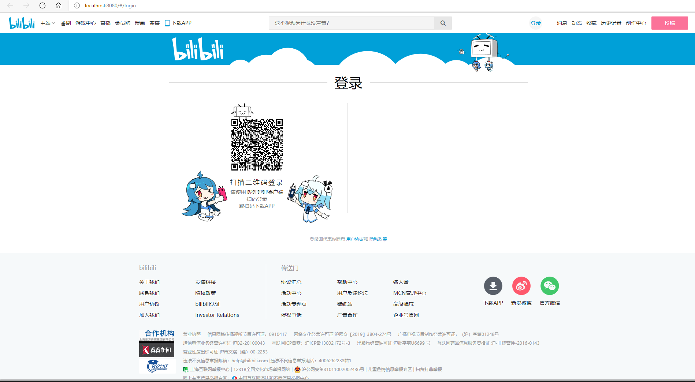

# bilibili_vue
## 免责声明
  本项目仅用于学习交流前端技术，如有侵权请联系我删除
## Project setup
```shell
npm install
```

### Compiles and hot-reloads for development
```shell
npm run serve
```

### Compiles and minifies for production
```shell
npm run build
```

### Lints and fixes files
```shell
npm run lint
```

### Customize configuration
See [Configuration Reference](https://cli.vuejs.org/config/).

## 项目说明

学习 Vue 用的项目，主要使用了 Vue2 + axios + Vuex +vue router + element-ui 

所有的样式都是直接从 b 站上扒下来的

图片和文字等数据大部分都是通过调用 b 站的 api 获得

api 部分来自第三方收集的，部分是我自己从官网上爬下来的

目前依旧还是半成品，不过功能已经七七八八了，后面就佛系更新了

漫画分区由于 api 有限制，axios 发的请求携带的 origin 无法通过检查，没什么好办法，因此用 express 做了个临时代理服务器来转发请求，特别推荐分区也有类似的情况，server 文件夹中放着转发请求用的代理服务器，需要开启才能获取漫画分区和特别推荐的数据

```shell
cd server
npm install
node app
```

登录界面目前只做了扫码登录，因为这个接口简单点，不过也够用了

由于b站很多图片是有防盗链的，虽然设置了 no-referer，但 css 里的 background-img 在部分浏览器（如 chrome）里的 referer 政策是按照图片来源的站点来的。。。所以在部分浏览器可能会有一些图片显示不出来。。。

## 项目展示

[哔哩哔哩 (゜-゜)つロ 干杯~-bilibili (bilibili.blueflame.org.cn)](https://bilibili.blueflame.org.cn/)

## 项目截图

 

  

 








