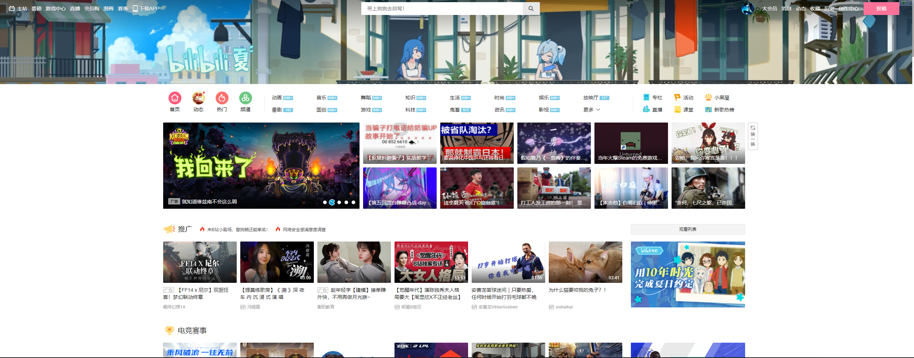
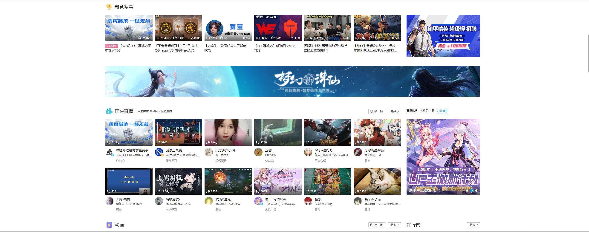
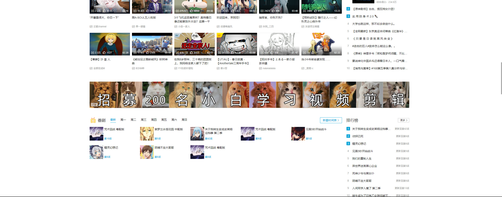
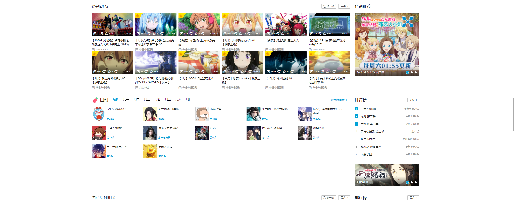
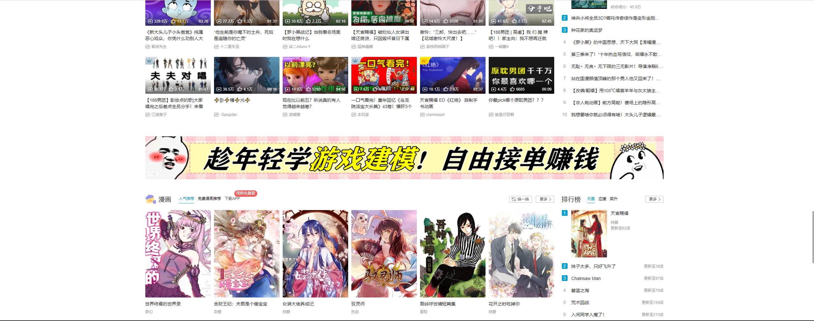
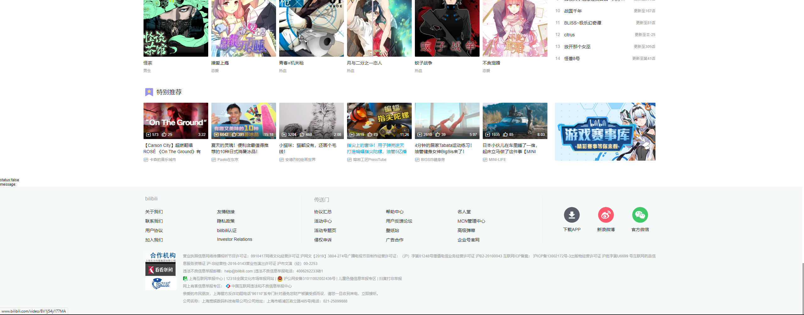

# bilibili_vue

## Project setup
```
npm install
```

### Compiles and hot-reloads for development
```
npm run serve
```

### Compiles and minifies for production
```
npm run build
```

### Lints and fixes files
```
npm run lint
```

### Customize configuration
See [Configuration Reference](https://cli.vuejs.org/config/).

## 项目展示













## 项目说明

学习 Vue 用的项目，使用了 Vue2 + axios + Vuex + vue-cookies + element-ui +vue-lazyload

所有的样式都是直接从 b 站上扒下来的

图片和文字等数据大部分都是通过调用 b 站的 api 获得

api 部分来自第三方收集的，部分是我自己从官网上爬下来的

目前依旧还是半成品，还在持续开发中

漫画分区由于 api 有限制，axios 发的请求携带的 origin 无法通过检查，没什么好办法，因此用 express 做了个临时代理服务器来转发请求，特别推荐分区也有类似的情况，server 文件夹中放着两个转发请求用的代理服务器，需要开启才能获取漫画分区和特别推荐的数据

```shell
node app 	//漫画分区代理服务器
node app2	//特别推荐代理服务器
```

由于部分样式登录前后有所不同，现在所有的样式都是按照登录后的，因为还没做登录界面，所以在首页底部放了个扫码登录的二维码（因为这个接口调用起来最方便），来获取登录的 Cookie，如果登录了，顶部轮播图右侧的推荐视频就是用户专属的，可以换一换，没登陆的话是公共的，没法换一换
